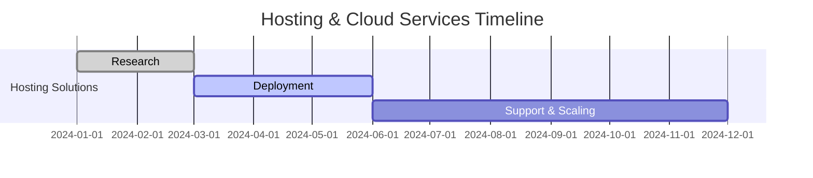

# Skunkworks Digital

Welcome to the official GitHub organization for **Skunkworks Digital**! We specialize in cutting-edge IT solutions, education, and consulting services for businesses and individuals. Our mission is to empower clients with technology-driven solutions while maintaining the highest standards of quality and innovation.

---

## 🚀 What We Do

Skunkworks Digital provides a wide range of services, including but not limited to:

### 🧑‍🏫 **IT Education Services**

| Service | Description |
|---------|-------------|
| 🎓 Accredited Training | Authorized education for IBM, Microsoft, Cisco, and CompTIA. |
| 🏆 Skills Development | Proprietary course catalog and tailored training services. |

### 💻 **Reselling Hardware & Software**

| Product Line | Details |
|--------------|---------|
| 🔄 Refurbished Devices | High-quality laptops and devices. |
| 📜 Software Licenses | Official licenses for Microsoft, Adobe, Sage, and more. |

### ☁️ **Hosting & Managed Cloud Services**

- 🌩️ Scalable cloud hosting solutions tailored to your business needs.
- 🔒 Fully managed cloud services for secure and reliable operations.

### 🌐 **Web Development, Digital Marketing, & SEO**

| Service | Description |
|---------|-------------|
| 💡 Web Development | Custom website design to establish your presence. |
| 📈 Digital Marketing | Strategies to grow your audience and engagement. |
| 🔍 SEO Optimization | Improve your visibility and rankings. |

### 🛠️ **Consulting & Implementation**
- 🌐 Specialized consulting for IBM software and hardware solutions.
- ⚙️ Custom implementation services to meet specific business needs.

### 📊 **Accounting Services**
- 💼 Partnered with Jamtax to provide expert accounting and financial services.

---

## 📂 Projects

This organization hosts various repositories dedicated to our projects and initiatives. Each repository includes detailed documentation to help you get started and contribute effectively. Highlights include:

- 📚 **Training Materials:** Resources and tools for IT education.
- 🤖 **Automation Tools:** Scripts and applications for streamlining IT workflows.
- 🛒 **Reselling Platforms:** Systems and frameworks for selling hardware and software online.
- 🌐 **Web Solutions:** Tools and templates for web development and digital marketing.

---

## 🌟 Get Involved

We welcome collaboration and contributions! Here’s how you can get started:

1. **Explore Repositories:** 🔍 Check out the repositories and find a project that interests you.
2. **File Issues:** 🐛 Spot a bug or have a feature request? Open an issue and let us know.
3. **Submit Pull Requests:** 🛠️ If you have code improvements or new features, submit a PR for review.
4. **Join Discussions:** 💬 Participate in our discussions to share ideas and feedback.

---

## 📞 Contact Us

For inquiries, collaborations, or support, feel free to reach out:

- 🌐 **Website:** [Skunkworks Digital](https://skunkworks.digital)
- 📧 **Email:** [support@skunkworks.digital](mailto:support@skunkworks.digital)
- 📞 **Phone:** +27 800 00 7277

Stay connected with us on social media for the latest updates and announcements.

---

## 📜 License

This organization’s repositories are licensed under the applicable terms provided in each repository. Please refer to the respective `LICENSE` file for details.

---

Thank you for visiting Skunkworks Digital! Together, let’s innovate and drive the future of technology.
